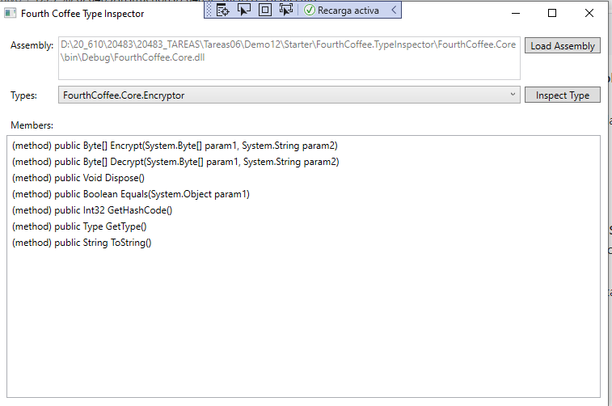

### Módulo 12: Creación de tipos y ensamblajes reutilizables

### Lección 1: Examinar los metadatos de los objetos

#### Demostración: Ensambles de inspección

1. añadir namespace System.Reflection

usign System.Reflection;

2. Crear un objeto assembly

````c#
private Assembly GetAssembly(string path)
{
	// TODO: 02: Create an Assembly object. 
	return Assembly.ReflectionOnlyLoadFrom(path);

}
````


3. Obtener todos los tipos de la tarea de ensamblaje actual 

````````c#
private Type[] GetTypes(string path)
{
	var assembly = this.GetAssembly(path);

	// TODO: 03: Get all the types from the current assembly. 
	return assembly.GetTypes();


}
````````

4. Obtener un tipo específico de la tarea de ensamblaje actual .

````c#
        private Type GetType(string path, string typeName)
        {
            var assembly = this.GetAssembly(path);

            // TODO: 04: Get a specific type from the current assembly. 
            return assembly.GetType(typeName);


        }
 
````



Cuando hacemos click en el botón Load Assambly Abrimos un dialogbox para seleccionar un ensamblado 
cargamos un Assembly con **Assembly.ReflectionOnlyLoadFrom(path)**;  
y carga el **Gettypes** 
recorreco todos los types devueltos metiendo en el combo **Type.FullName**

var assembly = Assembly.ReflectionOnlyLoadFrom(path);  
Type[]  tipos = assembly.GetTypes();

Recuerda los diferentes medodos de cargar un ensamblado con Assembly   
**LoadFrom**. Este método le permite cargar un ensamblado en el contexto de ejecución utilizando una ruta de archivo absoluta al ensamblaje.   
**ReflectionOnlyLoad**. Este método le permite cargar un ensamblado en un contexto de solo reflexión desde un objeto binario grande (BLOB) que representa el ensamblado.  
**ReflectionOnlyLoadFrom**. Este método le permite cargar un ensamblaje en un contexto de solo reflexión utilizando una ruta de archivo absoluta al ensamblaje.  

**FullName** (nombre colept, versión y clave pública)   
**GlobalAssemblyCache** para saber si el emsambla se cargo desde el GAC   
**Location** (path absoluto)   
**ReflectionOnly**. Esta propiedad le permite determinar si el ensamblado se cargó en un contexto de solo reflexión o en un contexto de ejecución. Si carga un ensamblado en un contexto de solo reflexión, solo puede examinar el código.   
**GetType**. Este método le permite obtener una instancia de la clase Type que encapsula un tipo específico en un ensamblado, según el nombre del tipo.  
**GetTypes**. Este método le permite obtener todos los tipos de un ensamblado en una matriz de tipo Type  


Recuerda también que podemos examinar los types  
type.**GetConstructors();**  
type.**GetFields();**   
type.**GetProperties();**  
type.GetMethods()**   


el botón GetType(typeName) lee el Assembly.GetType(name)  
con ello ya podemos leer las propiedaddes y métodos


````c#

this.RenderProperties(type.GetProperties());

this.RenderMethods(type.GetMethods());


private void RenderProperties(PropertyInfo[] properties)
	{
		foreach (var property in properties)
		{
			this.membersList.Items.Add(
				  string.Format(
					 "(property) {0} {1}",
					 property.DeclaringType.ToString(),
					 property.Name));
		}
	}

private void RenderMethods(MethodInfo[] methods)
	{
		foreach (var method in methods)
		{
			var signatureBuilder = new StringBuilder();

			signatureBuilder.Append("(method) ");

			if (method.IsPublic)
				signatureBuilder.Append("public ");

			if (method.IsStatic)
				signatureBuilder.Append("static ");

			signatureBuilder.AppendFormat("{0} ", method.ReturnType.Name);
			signatureBuilder.Append(method.Name);
			signatureBuilder.Append(this.GetParameters(method));

			this.membersList.Items.Add(signatureBuilder.ToString());
		}
	}


```````` 
  
### Lección 2: Creación y uso de atributos personalizados

#### Demostración: Ensambles de inspección


Se trata de añadir un atributo personalizado Developed by mail (o no developerinfo)


los atributos son decoraciones a los métodos que pueden hacer que se modificque la ejecución. entre ellos:

Obsolete
Seriealizable
NonSerialized
DataContract

Por ejemplo
[DataContract(Name = "SalesPersonContract", IsReference=false)]
public class SalesPerson { ... }


Para crear un atributo hay que seguir los siguientes pasos:
1. Crear un atributo que derive de la base Attribute o de otra de la que deriva esta.
2. Aplicar el AttributeUsage que describa que elementos pueden utilizarlo  (los errores se tratan en compilación)
3. Constructor para inicializar el atributo  
4. Defina las propiedades para las que desea que los usuarios del atributo proporcionen información de forma opcional. Cualquier propiedad que defina que tenga un descriptor de acceso get se expondrá a través del atributo como un parámetro con nombre.  

`````

[AttributeUsage(AttributeTargets.All)]  // 2.  pueden ser .all, . Event, . Field,  . ReturnValue, . Property ,.... 
public class DeveloperInfoAttribute : Attribute   //1.
{
   private string _emailAddress;
   private int _revision;
   public DeveloperInfo(string emailAddress, int revision)  // 3.
   {
      this._emailAddress = emailAddress;
      this._revision = revision;
   }
   public string EmailAddress            //4 .
   { 
      get { return this._emailAddress; }
   }
   public int Revision 
   { 
      get { return this._revision; }
   }
}

`````


Applying a Custom Attribute
````
[DeveloperInfo("holly@fourthcoffee.com", 3)]
public class SalePerson
{
   ...
   [DeveloperInfo("linda@fourthcoffee.com", 1)]
   public IEnumerable<Sale> GetAllSales()
   {
      ...
   }
}
````````````

y por útlimo como acceder a ellos con reflesión

var attributes = type.GetCustomAttributes(typeOf(DeveloperInfo), false)

attributes.EmailAddress  
attributes.Revision   
 
 Asi el códigofuente de la demo específico
 ````
private void ExtractAssemblyAttributes()
        {
            var type = typeof(Encryptor);

            // TODO: 01: Invoke the Type.GetCustomAttribute method.
            var typeAttribute = type.GetCustomAttribute<DeveloperInfo>(false);


            results.Items.Add(this.FormatComment(typeAttribute, type.Name, "Type"));

            foreach (var member in type.GetMembers())
            {
                // TODO: 02: Invoke the MemberInfo.GetCustomAttribute method.

                var memberAttribute = member.GetCustomAttribute<DeveloperInfo>(false);
                results.Items.Add(this.FormatComment(memberAttribute, member.Name, member.MemberType.ToString()));
            }
``````

y el ensamblado
````
using System;

namespace FourthCoffee.Core.CustomAttributes
{
    [AttributeUsage(AttributeTargets.All)]
    public class DeveloperInfo : Attribute
    {
        private string _emailAddress;
        private int _revision;

        public DeveloperInfo(string emailAddress, int revision)
        {
            this._emailAddress = emailAddress;
            this._revision = revision;
        }

        public string EmailAddress
        {
            get { return this._emailAddress; }
        }

        public int Revision
        {
            get { return this._revision; }
        }
    }
}

`

using FourthCoffee.Core.CustomAttributes;
.....................
namespace FourthCoffee.Core
{
	[DeveloperInfo("davidh@fourthcoffee.com", 5)]
	public class Encryptor : IDisposable
	{
		private byte[] _salt;
		private AesManaged _algorithm;
		[DeveloperInfo("hollyh@fourthcoffee.com", 5)]
		..................

``````


### Lección 4: Control de versiones, firma e implementación de ensamblados


#### Demostración: firma e instalación de un ensamblado en el GAC

Pendiente de ver la teoria....


