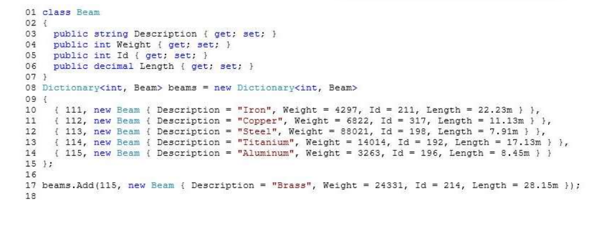

### QUESTION 194

#### Dictionary<TKey,TValue> Dictionary.ContainsKey Dictionary.Add 

You are developing a C# application. The application includes the following code segment. (Line numbers areincluded for reference only.)  




The application fails at line 17 with the following error message: "An item with the same key has already been added."  
You need to resolve the error.  
Which code segment should you insert at line 16?  


Solución: __A if (!beams.ContainKey (115))__  


efectivamente la linea 17 da un error  
   
bastaría con el if (!beams.ContainKey (115) para que no de errror   

```c#
using System;
using System.Collections.Generic;

namespace _194
{
    class Program
    {
        static void Main(string[] args)
        {
              Dictionary<int, Beam> beams = new Dictionary<int, Beam> {
                {111, new Beam {Description="Iron", Weight=4297, Id=211,Length=22.33m} },
                {112, new Beam {Description="Cooper", Weight=6822, Id=317,Length=11.13m} },
                {113, new Beam {Description="Steel", Weight=88021, Id=198,Length=7.91m} },
                {114, new Beam {Description="Titanium", Weight=14014, Id=162,Length=17.13m} },
                {115, new Beam {Description="Aluminium", Weight=3263, Id=196,Length=8.45m} }
            };
            if (!beams.ContainsKey (115))
                 beams.Add (115, new Beam {Description="Brass", Weight=24331, Id=214,Length=28.15m} );
            else
                Console.WriteLine ("El ID 115 ya existe, prueba con otro ID");
        }
    }

    public class Beam
    {
        public string Description {get;set;}
        public int Weight {get;set;}
        public int Id {get;set;}
        public decimal Length {get;set;}


    }
}
```

   