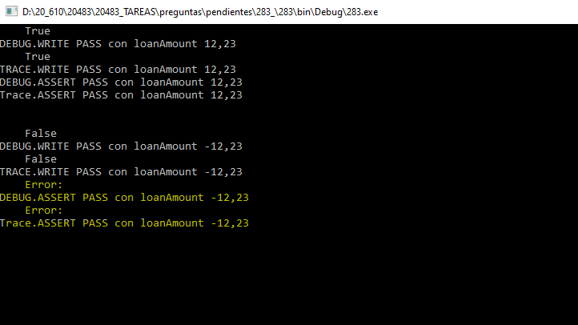
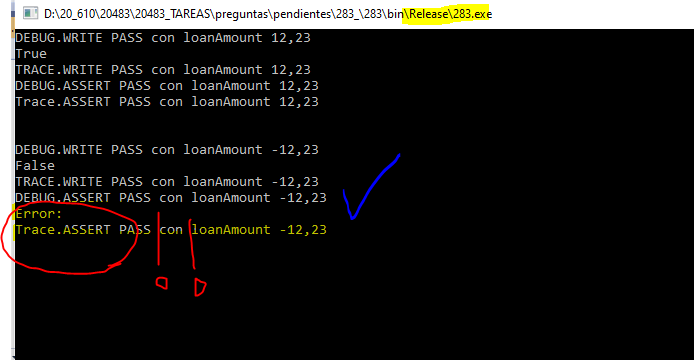

### QUESTION 283 

##### Sintaxis DEBUG/TRACE/ASSERT


You are debugging an application that calculates loan interest. 
The application includes the following code. 
Line numbers are included for reference only.

```c#

01	private static decimal CalculatedInterest (decimal loanAccount, int loanTerm, decimal LoanRate)
02	{
03
04	           deciaml interestAmount = loanAccount *  loanTerm * LoanRate;
05
06			   return interestAmount;
07	}
````

You have the following requirements:

The debugger must break execution within the Calculatelnterest() method when the loanAmount variable is greater than zero.
The release version of the code must not be impacted by any changes.


```c#

private static decimal CalculatedInterest (decimal loanAccount, int loanTerm, decimal LoanRate)
{
           decimal interestAmount = loanAccount *  loanTerm * LoanRate;
		   return interestAmount;
}
````

You need to meet the requirements.

What should you do?

A. Insert the following code segment at tine 05:

			Debug.Write(loanAmount > 0);

B. Insert the following code segment at line 05:

			Trace.Write(loanAmount > 0);

C. Insert the following code segment at line 03:

			Debug.Assert(loanAmount >= 0);

D. Insert the following code segment at line 03:

			Trace.Assert(loanAmount >= 0);

			
La respuesta correcta es C) 	Debug.Assert(loanAmount >= 0);


Debug.Write ó Trace.Write no hacen break al programa tan sólo escriben el parametro como mensaje en este caso True ó False. 
(la diferencia en es que Trace lo hace tanto en versiones Realease como Debug, mientras que Debug sólo en las versiones Debug)

Assert si lanza el break si la condición es true, pero como me dicen:
 "The release version of the code must not be impacted by any changes." entonces no puede ser Trace.Assert
 por lo que Debug.Assert es la Correcta
 
 
Resultados
version debug



version release




 
		
			
Explanation/Reference:

Explanation:

By default, the Debug.Assert method works only in debug builds.

Incorrect Answers:

D: Use the Trace.Assert method if you want to do assertions in release builds.

Reference:

https://docs.microsoft.com/en-us/dotnet/api/system.diagnostics.debug.assert


